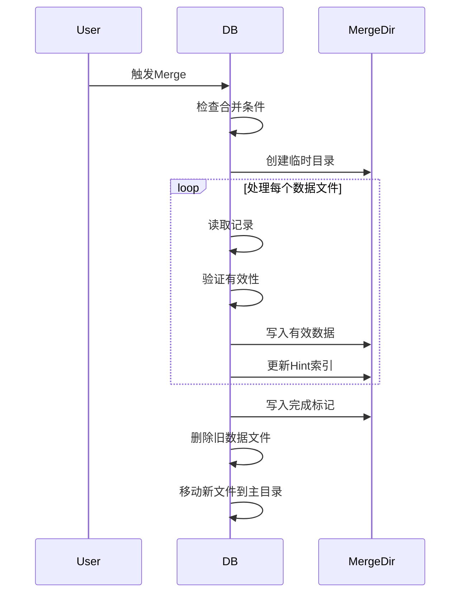

## merge

bitcask数据库的 **Merge（合并）功能**，主要用于清理无效数据、回收存储空间，并生成新的索引文件（Hint 文件）。以下是其核心实现逻辑的逐步解析：

------

### **1. 合并触发条件**

- **空间回收阈值**：当无效数据占比 (`reclaimSize / totalSize`) 达到配置的 `DataFileMergeRatio` 比例时触发
- **磁盘空间检查**：确保磁盘剩余空间足够容纳合并后的数据
- **互斥锁控制**：通过 `isMerging` 标志位防止并发合并

```go
// 检查合并比例是否达标
if float32(db.reclaimSize)/float32(totalSize) < db.options.DataFileMergeRatio {
    return ErrMergeRatioUnreached
}

// 检查磁盘空间
if uint64(totalSize-db.reclaimSize) >= availableDiskSize {
    return ErrNoEnoughSpaceForMerge
}
```

------

### **2. 准备合并环境**

- **切换活跃文件**：将当前活跃文件转为旧文件，创建新活跃文件
- **创建临时目录**：生成 `-merge` 后缀的临时目录存放合并结果
- **初始化临时DB**：基于临时目录创建新的数据库实例

```go
mergePath := db.getMergePath() // 生成类似 /data-dir-merge 的路径
mergeDB, err := Open(mergeOptions) // 打开临时DB
```

------

### **3. 数据合并过程**

- **遍历旧文件**：按文件ID从小到大处理所有旧数据文件
- **读取日志记录**：逐条解析数据文件中的记录
- **有效性校验**：通过内存索引判断记录是否最新有效
- **写入新数据**：有效记录写入临时DB，并记录到Hint文件

```go
for _, dataFile := range mergeFiles {
    var offset int64 = 0
    for {
        logRecord, size, err := dataFile.ReadLogRecord(offset)
        realKey, _ := parseLogRecordKey(logRecord.Key)
        logRecordPos := db.index.Get(realKey)
        
        // 检查是否为最新有效记录
        if logRecordPos.Fid == dataFile.FileId && logRecordPos.Offset == offset 		{
            mergeDB.appendLogRecord(logRecord) // 写入新文件
            hintFile.WriteHintRecord(realKey, pos) // 记录索引
        }
        offset += size
    }
}
```

------

### **4. 完成合并**

- **持久化数据**：调用 `Sync()` 确保数据落盘
- **写入完成标记**：创建 `merge.finished` 文件记录未合并的最新文件ID
- **文件替换**：删除旧数据文件，将临时文件移动到正式目录

```go
// 写入完成标记文件
mergeFinRecord := &data.LogRecord{
    Key:   []byte(mergeFinishedKey),
    Value: []byte(strconv.Itoa(int(nonMergeFileId))),
}

// 删除旧文件
for fileId := 0; fileId < nonMergeFileId; fileId++ {
    os.Remove(data.GetDataFileName(db.options.DirPath, fileId))
}

// 移动新文件
os.Rename(srcPath, destPath)
```

------

### **5. 合并恢复机制**

- **加载时检查**：数据库启动时检测 `-merge` 目录
- **完成性验证**：通过 `merge.finished` 文件判断合并是否成功
- **索引重建**：从Hint文件快速恢复内存索引

```go
func (db *DB) loadMergeFiles() error {
    // 检查 merge 目录是否存在
    if _, err := os.Stat(mergePath); os.IsNotExist(err) {
        return nil
    }
    
    // 验证是否完成合并
    if mergeFinished {
        // 删除旧文件并移动新文件
    }
}
```

------

### **关键设计要点**

1. **原子性保证**：
   - 通过 `merge.finished` 标记文件确保合并操作的原子性
   - 只有完整完成的合并才会被最终应用
2. **空间回收**： 
   - 跳过无效记录（被更新或删除的数据）
   - 实际减少磁盘占用空间
3. **性能优化**：
   - Hint文件避免全量数据扫描
   - 按文件ID顺序处理减少随机IO
4. **并发控制**：
   - `isMerging` 标志位防止并发合并
   - 互斥锁 (`mu.Lock()`) 保护关键操作

------

### **流程图解**



该实现通过精心设计的文件操作和状态管理，在保证数据一致性的前提下，实现了高效的空间回收和索引优化。

