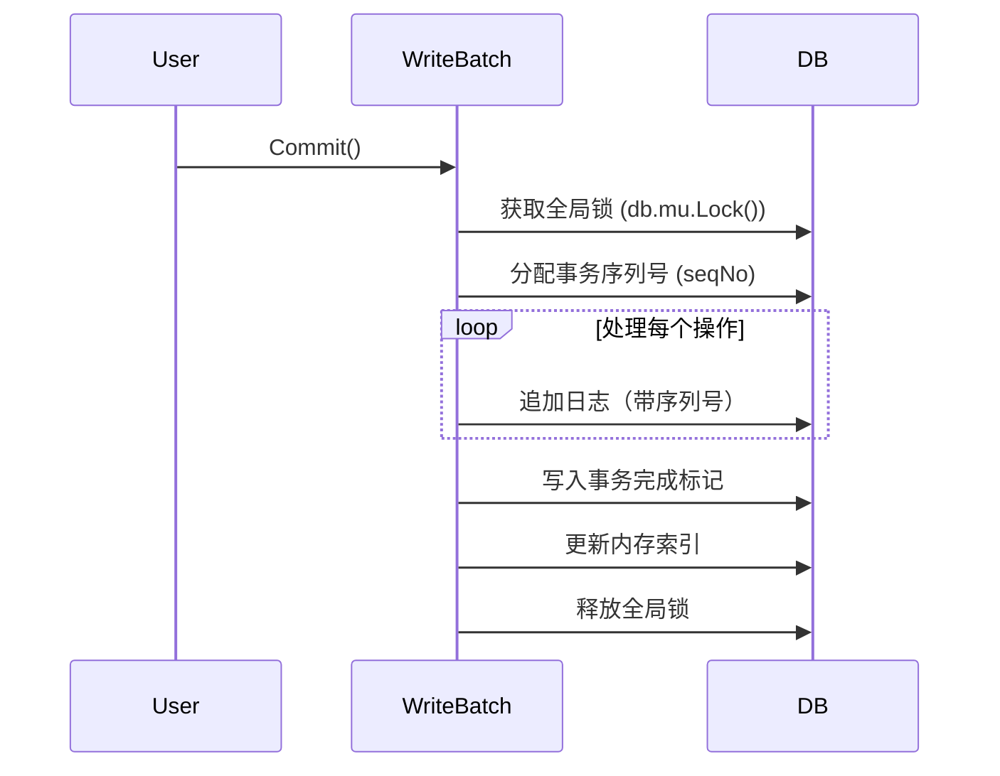

这段代码实现了 **Bitcask 存储引擎的原子批量写入（WriteBatch）功能**，以下是核心机制的分步解析：

------

### **1. 设计目标**

- **原子性**：批量操作要么全部成功，要么全部失败
- **事务隔离**：未提交的修改对其他操作不可见
- **高性能**：通过批量写入减少 IO 次数

------

### **2. 核心结构**

```go
type WriteBatch struct {
    options       WriteBatchOptions  // 配置参数（最大批量数、是否同步等）
    mu            *sync.Mutex        // 互斥锁保证线程安全
    db            *DB                // 关联的数据库实例
    pendingWrites map[string]*data.LogRecord // 暂存待提交的写入
    //用一个map来存，可以避免一个写入重复提交
}
```

------

### **3. 操作流程**

#### **(1) 添加操作（Put/Delete）**

- **暂存到内存**：写入/删除操作先缓存在 `pendingWrites` 中
- **Delete 特殊处理**：若 key 不存在则直接忽略

```go
func (wb *WriteBatch) Put(key []byte, value []byte) error {
    // 暂存到 map
    wb.pendingWrites[string(key)] = &data.LogRecord{Key: key, Value: value}
}

func (wb *WriteBatch) Delete(key []byte) error {
    // 检查 key 是否存在
    if logRecordPos := wb.db.index.Get(key); logRecordPos == nil {
        delete(wb.pendingWrites, string(key)) // 不存在则移除暂存
    }
    // 暂存删除标记
    wb.pendingWrites[string(key)] = &data.LogRecord{Key: key, Type: Deleted}
}
```

#### **(2) 提交事务（Commit）**



------

### **4. 关键实现细节**

#### **(1) 事务序列号机制**

- **全局递增序列号**：通过原子操作分配唯一事务 ID

```go
seqNo := atomic.AddUint64(&wb.db.seqNo, 1)//递增
```

- **Key 编码**：将序列号嵌入 key 中

```go
// 编码示例：seqNo=123, key="name" → [0x87 0x01] + "name"
func logRecordKeyWithSeq(key []byte, seqNo uint64) []byte {
    seq := make([]byte, binary.MaxVarintLen64)
    n := binary.PutUvarint(seq, seqNo)
    return append(seq[:n], key...)
}
```

#### **(2) 原子性保证**

- 两阶段写入：
  1. 先写入所有操作记录（带相同 seqNo）
  2. 最后写入 `txn-fin` 标记记录

```go
// 写入事务完成标记
finishedRecord := &data.LogRecord{
    Key:  logRecordKeyWithSeq(txnFinKey, seqNo),
    Type: data.LogRecordTxnFinished,
}
db.appendLogRecord(finishedRecord)
```

#### **(3) 崩溃恢复**

- **未完成的事务**：缺少 `txn-fin` 标记的操作会被忽略
- **已完成的事务**：通过 seqNo 顺序重放所有操作

------

### **5. 索引更新策略**

- **延迟更新**：直到事务完成才更新内存索引
- **批量更新**：遍历 `pendingWrites` 统一处理

```go
for _, record := range wb.pendingWrites {
    if record.Type == Normal {
        wb.db.index.Put(record.Key, pos)
    } else {
        wb.db.index.Delete(record.Key)
    }
}
```

------

### **6. 性能优化**

| 优化措施         | 实现方式                                                |
| ---------------- | ------------------------------------------------------- |
| **批量 Sync**    | 根据配置决定是否每次提交都 Sync (wb.options.SyncWrites) |
| **序列化写入**   | 全局锁保证单事务顺序写入                                |
| **内存操作优先** | 所有操作先在内存中暂存，提交时批量处理                  |

------

### **示例场景**

**操作序列**：

1. 开启事务
2. Put key1=val1
3. Delete key2
4. Commit

**磁盘写入顺序**：

```markdown
[key1+seq=1] → val1
[key2+seq=1] → (Deleted标记)
[txn-fin+seq=1] → 空
```

**内存索引更新**：

- 只有检测到 `txn-fin` 后才更新 key1 和 key2 的索引

------

该实现通过巧妙的序列号编码和完成标记机制，在保证原子性的同时兼顾了性能，是日志型存储引擎事务处理的经典设计模式。